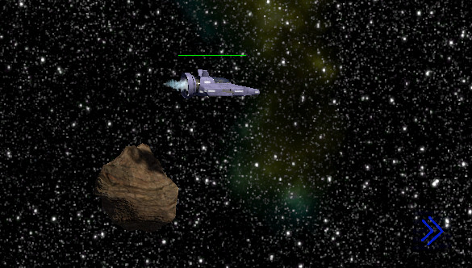
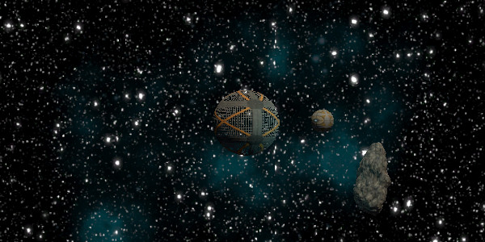
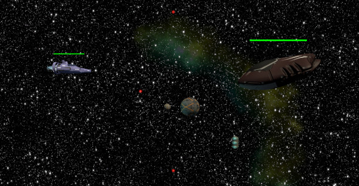
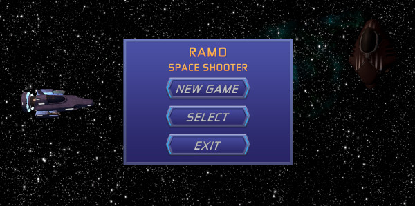
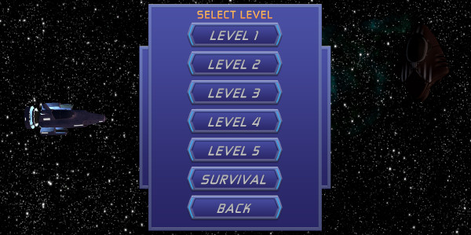
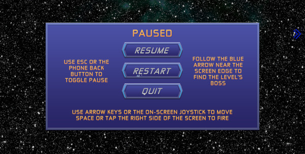
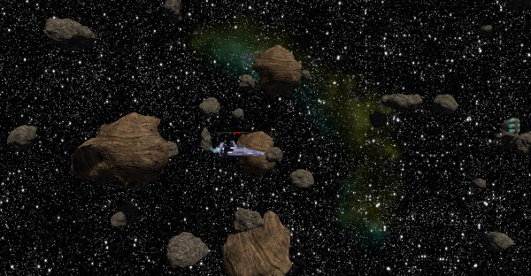

# RAMO space shooter

Development of this game started as the final paper for a 2020/21 2D game programming course that was part of the curriculum for the Open University of Catalonia (UOC)'s master on mobile application development. The requirement was to create a fully playable game on any subject the student choose.

A sample gameplay video is available in [YouTube](https://youtu.be/h0VmlIKSpVM)

There is an overview on how I chose the subject and the whole development process during the course on the [COURSE_DEFENSE](COURSE_DEFENSE.md) document.

## How to play

At the start of the game the player sees a title page, click/touch the screen or press enter and it will display the menu. The screen has instructions for this.

The menu lets users play from the start, select a level or quit. Buttons indicate their function.

During the game, the player can control the _spaceship_ using the on-screen joystick and/or with the arrow keys. To _shoot_, both the space bar and a touch on the right side of the screen are valid.

`ESC` pauses the game, displaying a dialog with instructions and three options, _continue_, _start a new game_ and _quit_.

### World navigation

The game aims to be a side-scroller space-shooter with a twist, part of that twist is that the game takes place in an open world, I think that could let us add some interesting updates later on, for example, different missions inside one level.

At the moment, each level only has one mission, _find the boss and destroy it_, since the play takes place in an open world, we need to give the player some help accomplishing the task, some indication of wherein lays the _boss_, we can use an on-screen arrow that points in the bosses' direction to accomplish that. The result will look as follows:

_The use of an on-screen arrow allows to have, at the same time, an open-end world with mission mechanics._

### Enemies

The types of enemies that we will encounter on the level can be classified in two groups, regular enemies and bosses.

#### Regular enemies (Capsules)

This enemies are spawned at random intervals by a _spawner_ game object that stays slightly ahead of the player as she moves through the level.

The spawner is slightly bigger than the screen height and spawns elements at random intervals, within a range, and at random points of the _quad_ element that is made of. The spawning rate range can be adjusted from the editor to make levels progressively harder.

The _basic_ regular enemies are capsule shaped ships that do not fire any shots and just try to collide with the player character. This characters use the [Astar project][5] for pathfinding.

#### Regular enemies (Spheres)

The second type of enemy created is a sphere shape with a metal texture that follows the player while keeping it's distance. The sphere has a satellite circling it that shoots the player at semi-random intervals controlled from the editor settings.

This enemy is harder to kill than the capsules so the spawner generates less of them, currently, the game is set to generate at a ratio of 0.2/0.8 favouring the capsules, though the generation does use a randomizer and we could have more of one type at any given time.

#### Bosses

At the end of every campaign scene waits a boss. Currently the game only uses one design, but it would be easy to add more just by changing the model used.

_Boss type enemy._

The bosses are highly configurable from within the editor, grab them from the prefab folder and drop them in a scene and, configuring a few parameters, like the number of shots, the frequency and the speed of the bullets, and you can have a boss that is easy, or almost impossible, to beat.

### User interface

#### Start menu

At the start of the game, is good to offer a simple interface that entices users to start the game as quick as possible. I opted for a simple interface with three options, _play_, _select level_ and _quit_ and some special effects, like a point light that moves around the scene to give the impression of time moving.

_Main menu at the start of the game._

_Secondary menu that lets users play any level on the game._

#### Pause overlay

An overlay is used to let the user decide what to do after the pause: **quit** the game, **resume** the game at the point we left it and **restart** a new game, from the menu page.

_Pause overlay._

The game is paused while the screen is visible. In **mobile** clicking the back button triggers the pause.

### Level design

The game is structured on progressively harder levels that should let the users get used to all game features as they play. Levels are short by design, and the player can choose levels from the start menu.

The levels are short by design. The aim in to recreate the dynamic of popular games like _League of Legends_ where a _play_ only lasts a few minutes.

#### Level 1: Easy-peasy

A basic introduction to game play. Only enemy capsules and the final boss, both of them with very easy settings. The _spawner_ generates one enemy capsule between 4 and 15 seconds each, and the boss only fires three shots simultaneously every 1 to 3 seconds.

There are some _obstacle_ objects, but none of them is in the player's way.

#### Level 2: Warming-up engines

Level 2 does not introduce any new elements but speeds up the game, starting to hint at the fast-pace dynamic. Spawning interval is set between 2 and 10 seconds and boss fires every 0.5 to 1 second, still only 3 bullets.

#### Level 3: Air marshall

Introduces the new enemy type _sphere_ and it speeds up the spawning interval to between 1 and 8 seconds. Boss fires every 0.5 to 1 second, 5 bullets that move a bit faster than on previous levels.

#### Level 4: Asteroid field

The boss and enemy spawner settings are similar to the previous level, the spawner has a slightly wider generation span along the `Y` axis, to make enemies harder to detect, and a slightly lower `maxWait` value.

The added element in this level comes from the higher number of asteroids being generated, that help hide enemies from the player's field of vision, giving them less time to react.

#### Level 5: Argon

Being the final level at the moment, it presents the highest difficulties, spawner generates new enemies one each every 0.2 to 4 seconds, and boss fires 7 bullets every 0.1 to 1 second, the central bullet is aimed towards the player position on fire.

#### Extra survival level: Mayhem

This level is an example of interesting variations that we can generate with the modular architecture that the game components have. By removing the _Boss_ and so the _mission_ element of a level, we can completely change the dynamic and create a _melee_ style level where the objective is to survive as long as possible.

To make survival more complicated, there are two **Spawner** elements, one at the usual position in front of the player, generating enemies much quicker than during the regular game levels, and one back from the player, generating less enemies, but enough for them having to account for this extra difficulty.

**Mayhem** is a simple level where we have removed most of its elements but, due to its _different_ nature, is a very fun level to play.

## Looking forward

Since we started with a very modular game that takes place in an open world, there are many features we can add:

- Entire campaigns.
- Enemy types.
- Different player weapons.
- Player defenses, like a force field.
- Implementing a save mechanism.
- Implementing an online score mechanism for both _points_ and _time survived_ on the different survival style levels.
