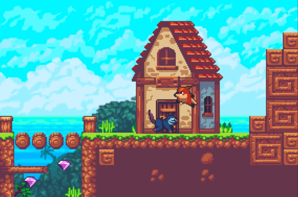
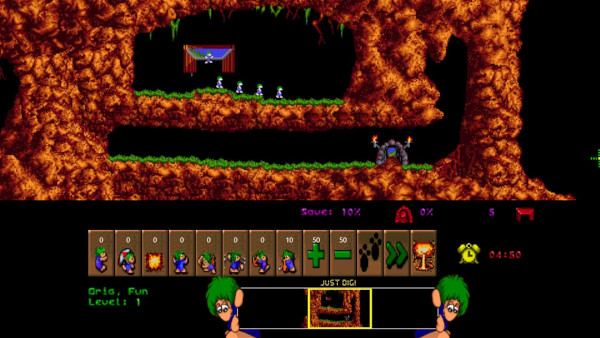
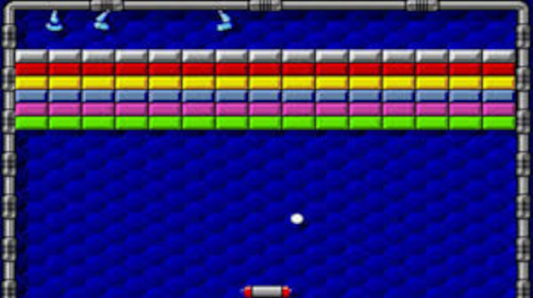
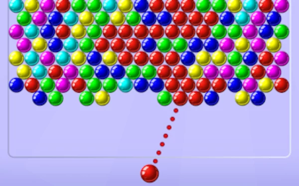
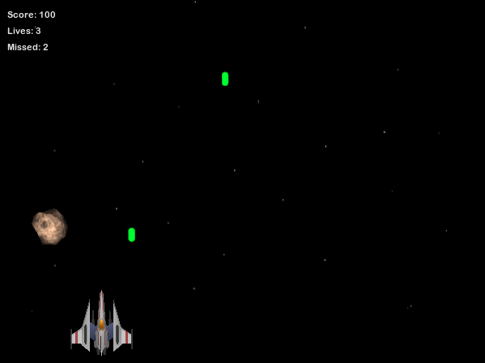
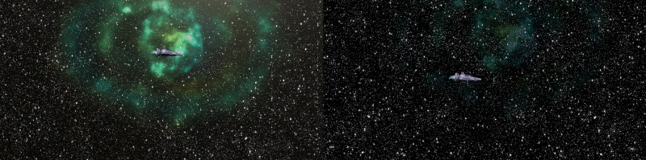
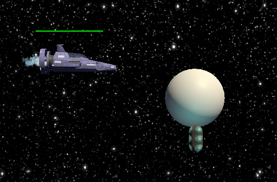
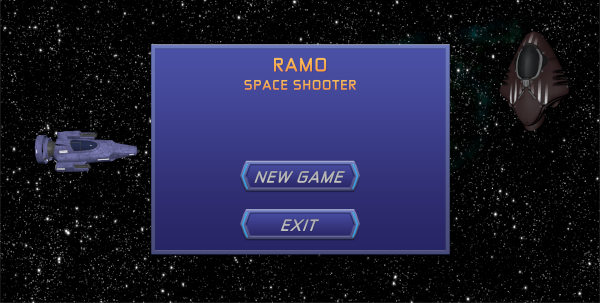
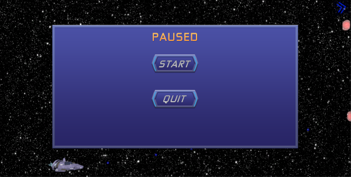

# Practicum

Final paper for the 2020/21 2D game programming course. Create a fully playable game on any subject you choose.

## Choosing a theme.

Choosing a theme for the game is probably the single decision that will bear the biggest influence on the resulting game, so I decided to take as much time as needed. During the first few days of the decision process, I followed a few tutorials that offered advice for beginner and intermediate game developers, out of them I got the idea that a few points were key making a good decision:

1. The game had to be about a subject I liked myself. There are a few reasons for this, but the most obvious are that you will enjoy more the development process, and that you will be more familiar with what makes a good game.
2. Be conservative, the development process will, very likely, be harder than you expect. If you choose an objective that is too ambitious, you are likely to either never finish the game or to have so many different aspects to worry about that you will not have the resources to implement every aspect properly.
3. The most successful games are not necessarily the most innovative ones, usually they follow a well established pattern; "introduce a new twist while still falling inside a category that is familiar to players".

With these guidelines in place, I started looking at options.

### A platformer game using the [Sunny Land][24] asset pack.



**Why?** This is something that I kept thinking about while developing the Mario-like game for the previous exercises, this asset pack looked fun to work with. I had just developed a pretty complete platformer game, most of that experience would help develop a better game if I had chosen this option.

**Why not?** I felt like, after working in a platformer for almost two months, I could learn more from working with a different style game.

### A Lemmings style game.



**Why?** This was one of my favorite games back on its day, and I feel like it could still be very fun to play even in the original form, even more so with some twists.

**Why not?** This game introduces many aspects that are very different to the style that I developed before. I wasn't completely sure I could produce a good quality game in the amount of time available.

### An break-bricks style game.



**Why?** This seems like a simple concept that should be fairly simple to implement. Once you have a playable game, you can introduce more variations to the _powerups_ and _bricks_ to make the game more interesting.

**Why not?** I feel like, with this style of game, most of the functionality could be implemented in-house, and I felt like experimenting with some packages that added functionality to the game, like particle systems, Cinemachine and other assets from the **Unity Asset Store**.

### A bubble-shooter.



**Why?** Cool concept, very different from the platformer dynamic but it seems like it should be possible to keep it simple and create a playable game within the time boundary given.

**Why not?** It was a close call, there wasn't really a reason why not, finally I thought that the space shooter would be more dynamic and more fun to play.

### A space shooter.



**Why?** Offers the possibility to build a fast-paced game with nice imagery and lots of visual effects. I couldn't really find many points against this theme. It could prove to be too complex, but it seems like it should be possible to provide, at the very least, a few playable levels in the amount of time provided. So this is the theme I decided to develop.

## The development process outline.

In this case, I think the visual part of the game is going to be very important, it makes sense to build the basic functionality first, without worrying too much about the looks, and then try imagery on to see what it looks like when the game is running.

The objective is to create a space shooter that runs in an open world where the player has to complete one mission per level. As the player approaches the level's objective, it will become harder to survive.

Levels should be progressively harder. The player should be able to learn about the enemies in earlier levels to help survive later levels.

We will start by creating a `Player` GameObject and giving it a controller. From the beginning we are going to give the game a **mobile first** approach, so the game will get mobile controls and any actions available have to be operable by touch.

Next will come the _backdrop_ the game is set against, we can keep the backdrop small and make it follow the player using some _parallax_ technique.

After that we will add enemies with different characteristics.

Then we can create a UI.

Last step would be to add details, music, sound effects, improve the lighting, check physics work as expected and other post-production aspects.

Once we have a few basic blocks, creating new levels should be easy:

- Create a new scene.
- Drop a few components.
- Adjust a few parameters in the scene, from the editor if possible.

Ideally, that should be all that is needed to create new playable levels.

## Work done.

### Outline requirements.

- The player's space fighter can decelerate or accelerate in 2D, while there is no player input, the spacecraft preserves its current speed.
- Each level is an open world, the player can choose to get farther away from the objective.
- Each level has an objective. Survival should get progressively harder as the player approaches the objective.
- The camera uses the _perspective_ view, to give some depth to the game. But all game interactions happen on `z=0` making it a 2D game.
- Background scrolls with the player.
- Enemies, except for the level's _boss_ are auto-generated according to some parameters.

### Star background.

The objective is to have a multi-layer star background that gives an impression of depth, we are in space after all!

The game has two star backgrounds that are children of the main camera, since the camera follows the player, the background also does. To make a _parallax_ effect, we can use the material's offset thus:

```c#
void Update()
{
    MeshRenderer mr = GetComponent<MeshRenderer>();
    Material material = mr.material;
    Vector2 offset = material.mainTextureOffset;
    offset.x = transform.position.x / transform.localScale.x * parallax;
    offset.y = transform.position.y / transform.localScale.y * parallax;
    material.mainTextureOffset = offset;
}
```

The `parallax` variable is editable from within the inspector, giving it different values, we can adjust the speed of each _layer_ until it feels adequate.

The star background was inspired by this [video tutorial][1].

Having a slightly different backdrop for each level can help players quickly identify which level they are currently at, besides helping giving each of them a different atmosphere.

That would be difficult to achieve using just the star background, and we want the obstacles to be just a coincidental, not a defining part of the level, at least until later levels, where they can become NP _characters_ and _attack_ the player.

Being already in space, we can use _nebula like_ images for this end, each level can have a different nebula as a backdrop, achieving two ends, first, it makes the level look better, then it helps the player quickly know _where_ they are in the game.

Ideally, we want the nebula backdrop to scroll even slower than the farthest starfield background, on the 2.5D game that we are developing, we could use another parallax script to this end, but, since we don't care if the component disappears form the screen view, it is easy to achieve the same result placing the component far back and scale it up. This setup also makes it easy to configure the look and feel of the backdrop on different levels, and use Unity's built-in functions to modify it, for example, adding a bit of light, we can achieve effects like the following.



> Nebula backdrops make it easy to create compelling level backdrops.

### World navigation.

The game aims to be a side-scroller space-shooter with a twist, part of that twist is that the game takes place in an open world, I think that could let us add some interesting updates later on, for example, different missions inside one level.

At the moment, each level only has one mission, _find the boss and destroy it_, since the play takes place in an open world, we need to give the player some help accomplishing the task, some indication of wherein lays the _boss_, we can use an on-screen arrow that points in the bosses' direction to accomplish that. The result will look as follows:

// TODO screen capture with arrow here.

### Enemies.

The types of enemies that we will encounter on the level can be classified in two groups, regular enemies and bosses.

#### Regular enemies (Capsules).

This enemies are spawned at random intervals by a _spawner_ game object that stays slightly ahead of the player as she moves through the level.

The spawner is slightly bigger than the screen height and spawns elements at random intervals, within a range, and at random points of the _quad_ element that is made of. The spawning rate range can be adjusted from the editor to make levels progressively harder.

The _basic_ regular enemies are capsule shaped ships that do not fire any shots and just try to collide with the player character. This characters use the [Astar project][5] for pathfinding.



As a material the capsules use material no.12 on the [Yughues Free Metal Materials][19] pack from the Unity asset store. To improve the look of the enemies I added a subtle point light, of the same color that the light sections of the material. The scenery is supposed to be an important part of the game, and the light from the _capsules_ reflecting on the background objects adds a very interesting flavor.

To make the objects more dynamic, I added a [`Spinner` script][21] that initially I had planned to use only on background objects, like asteroids, to make them spin on place.

The script is very simple but effective. It takes a `speed` `Vector3` initialization from the editor, or a default of `(1,1,1)` if not set from the editor, and it uses it, inside the `Update` method to rotate the transform thus:

```c#
transform.Rotate(speed * Time.deltaTime);
```

#### Bosses.

TODO fill this up.

### User interface.

#### Start menu.

At the start of the game, is good to offer a simple interface that entices users to start the game as quick as possible. I opted for a simple interface with two options, _play_ and _quit_ and some special effects, like a point light that moves around the scene to give the impression of time moving.



#### Pause overlay.

During the development of this game, I learnt that [we can use `Time.timeScale`][8] as an easy way to pause any game activities that are related with game time, which in this game means all of the activities, effectively giving us a way to pause/restart the game using one line of code.

```c#
Time.timeScale = 0;
```

An overlay was used to present the user with the _pause_ options, namely **quit** and **start**.



The game is paused while the screen is visible. In **mobile** clicking the back button triggers the pause.

### Level design.

The game is structured on progressively harder levels that should let the users get used to all game features as they play. Levels are short by design, and the player can choose levels from the start menu.

The levels are short by design. The aim in to recreate the dynamic of popular games like _League of Legends_ where a _play_ only lasts a few minutes.

#### Level 1: Easy-peasy.

A basic introduction to game play. Only enemy capsules and the final boss, both of them with very easy settings. The _spawner_ generates one enemy capsule between 4 and 15 seconds each, and the boss only fires three shots simultaneously every 1 to 3 seconds.

There are some _obstacle_ objects, but none of them is in the player's way.

#### Level 2: Warming-up engines.

Level 2 does not introduce any new elements but speeds up the game, starting to hint at the fast-pace dynamic. Spawning interval is set between 2 and 10 seconds and boss fires every 0.5 to 1 second, still only 3 bullets.

## Issues found.

### DontDestroyOnLoad GameObject.

At the start of the development process I decided to have a singleton `Game` script, that would act as the _game manager_ and assign it to the `UI` game object. This seemed to be what made most sense, besides being some kind of a _Unity_ convention.

But during the development process, I found that having the `UI` endure between scenes was giving me more problems than help, and it was adding a lot of boilerplate code. A lot of subscribing to scene load events and unsubscribing, I had to move UI related objects out of the main `UI` game object, because they should not outlive their own scene's destruction, and I also found that it was hard to configure the UI objects in a manner that suited the scene, my C# had to check what scene we were on and, based on that, configure a group of objects that kept changing. It started to seem that it would make more sense to not have persistent UI objects and being able to configure them from within the editor.

At the same time, I was looking for ways to persist my player state between scenes, and sharing data between the player and the UI, data that didn't make sense to share, it all started to have code-smell.

At that point, I decided to give a new idea a try, since it seemed that I didn't need most of the UI objects to persist, and instead needed the `Player` to be aware about it's state on the game, not only in the current scene, I decided to switch the `DontDestroyOnLoad` from the UI to the Player, and created a new `PlayerState` class dedicated solely to store, and share, information about the player's current state.

The change paid off immediately, `PlayerState` turned out to be very simple, clear and effective, and `Game` quickly lost half it's size and two thirds of its complexity, becoming much more manageable and easier to use and modify.

## Attributions.

### Assets.

#### Full prefabs.

The player's **space fighter** was crafted by [Devekros][3] and it is available at [this link][4] in the Unity Asset Store.

The built in **UI elements** come from the [Techno Blue GUI Skin asset][9] on the asset store. The custom text was created following this [video tutorial][7].

Some of the asteroids come from the free [Asteroids Pack][11] by [Mark Dion][12] on the Unity Asset Store.

#### Textures and materials.

Most of the asteroids were created by hand using Unity's [Polybrush][15].

Metal texture from the [Yughues Free Metal Materials][19] asset by [Nobiax / Yughues][20].

#### Music and sound effects.

The menu scene uses the [Deep In Space][22] asset by [Breitbarth][23] for ambiance music.

The game uses music from the [Absolutely Free Music][13] asset by [Vertex Studio][14] on the following levels:

- Title page: track no.11.
- Level 1: track no.6.
- Level 2: track no.31.
- Credits page: track no.1.

Gunshot and laser sounds from the [Futuristic Gun Sound FX][16] asset by [MGWSoundDesign][17].

Explosion sounds from the [Grenade Sound FX][19] asset by [MGWSoundDesign][17].

### References.

Scrolling star background [video tutorial][1].

Cinemachine [video tutorial][2].

Astar project [website][5].

UI using _screen camera_ instead of _screen overlay_ [tutorial][6]. Removes clutter while developing.

Nice gradient for menu text on this [tutorial][7].

Using `Time.timeScale` to [pause the game][8].

Touch controls [tutorial][10].

Inspiration for the circular light movement from this [tutorial][18].

[1]: https://www.youtube.com/watch?v=nGw_UBJQPDY
[2]: https://www.youtube.com/watch?v=2jTY11Am0Ig
[3]: https://assetstore.unity.com/publishers/34228
[4]: https://assetstore.unity.com/packages/3d/vehicles/space/space-shuttle-of-the-future-111392
[5]: https://arongranberg.com/astar/
[6]: https://www.youtube.com/watch?v=VHFJgQraVUs
[7]: https://www.youtube.com/watch?v=zc8ac_qUXQY
[8]: https://gamedevbeginner.com/the-right-way-to-pause-the-game-in-unity/
[9]: https://assetstore.unity.com/packages/2d/gui/techno-blue-gui-skin-19115
[10]: https://www.youtube.com/watch?v=bp2PiFC9sSs
[11]: https://assetstore.unity.com/packages/3d/environments/asteroids-pack-84988
[12]: https://assetstore.unity.com/publishers/27658
[13]: https://assetstore.unity.com/packages/audio/music/absolutely-free-music-4883
[14]: https://assetstore.unity.com/publishers/2053
[15]: https://unity3d.com/unity/features/worldbuilding/polybrush
[16]: https://assetstore.unity.com/packages/audio/sound-fx/weapons/futuristic-gun-soundfx-100851
[17]: https://assetstore.unity.com/publishers/27115
[18]: https://www.youtube.com/watch?v=BGe5HDsyhkY
[19]: https://assetstore.unity.com/packages/2d/textures-materials/metals/yughues-free-metal-materials-12949
[20]: https://assetstore.unity.com/publishers/4986
[21]: https://gitlab.com/raul.sauco/prog2D-practica/-/blob/master/Ramo/Assets/Scripts/Background/Spinner.cs
[22]: https://assetstore.unity.com/packages/audio/music/electronic/deep-in-space-88071
[23]: https://assetstore.unity.com/publishers/27455
[24]: https://assetstore.unity.com/packages/2d/characters/sunny-land-103349
